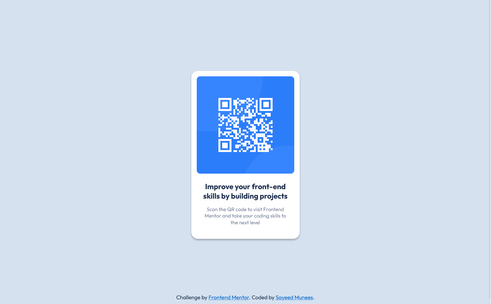

# QR code component - Solution

This is a solution to the [QR code component challenge on Frontend Mentor](https://www.frontendmentor.io/challenges/qr-code-component-iux_sIO_H). This solution ensures a visually appealing QR code component.

## Table of contents

- [Overview](#overview)
  - [The challenge](#the-challenge)
  - [Screenshot](#screenshot)
  - [Links](#links)
- [My process](#my-process)
  - [Built with](#built-with)
  - [What I learned](#what-i-learned)
  - [Useful resources](#useful-resources)
- [Author](#author)

## Overview

### The challenge

- Develop the given QR code component.

### Screenshot

- Design preview of the QR code component



### Links

- Solution URL: [Click here](https://github.com/sayeedmunees/qr-code-component-challenge)

- Live Site URL: [Click here](https://sayeedmunees.github.io/qr-code-component-challenge/)

## My process

### Built with

- Semantic HTML5 markup
- CSS custom properties
- CSS Flexbox

### What I learned

Throughout this project, I've discovered the transformative power of Flexbox in crafting responsive layouts. Also used some box shadow.

Here's a snippet demonstrating the use of Flexbox and Box shadow,

```css
.card {
  display: flex;
  flex-direction: column;
  width: 320px;
  height: 497px;
  border-radius: 20px;
  background-color: white;
  box-shadow: 0px 4px 4px 0px rgba(0, 0, 0, 0.25);
}
```

### Useful resources

- [Frontend Mentor](https://www.frontendmentor.io/challenges/qr-code-component-iux_sIO_H) - Got this challenge from Frontend Mentor,along with workfiles like required designs, icons and other files.

- [MDN Docs](https://developer.mozilla.org/en-US/) - Here's another useful resourse, which is the MDN web Docs itself. It helped me to find, understand and to use code snippets that i didn't knew before.

## Author

- GitHub - [@sayeedmunees](https://github.com/sayeedmunees)
